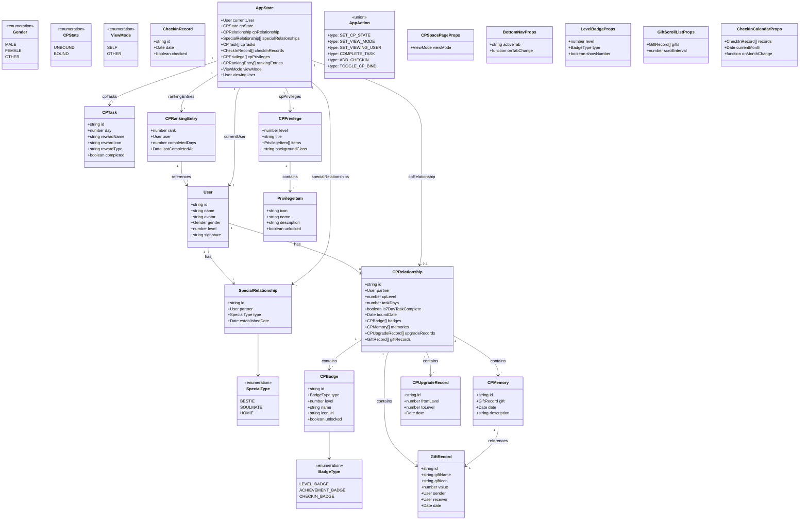
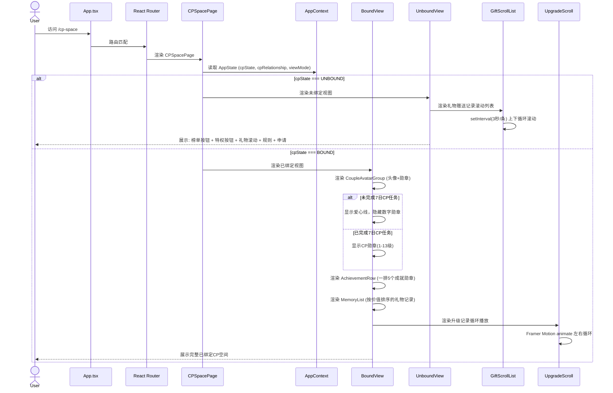
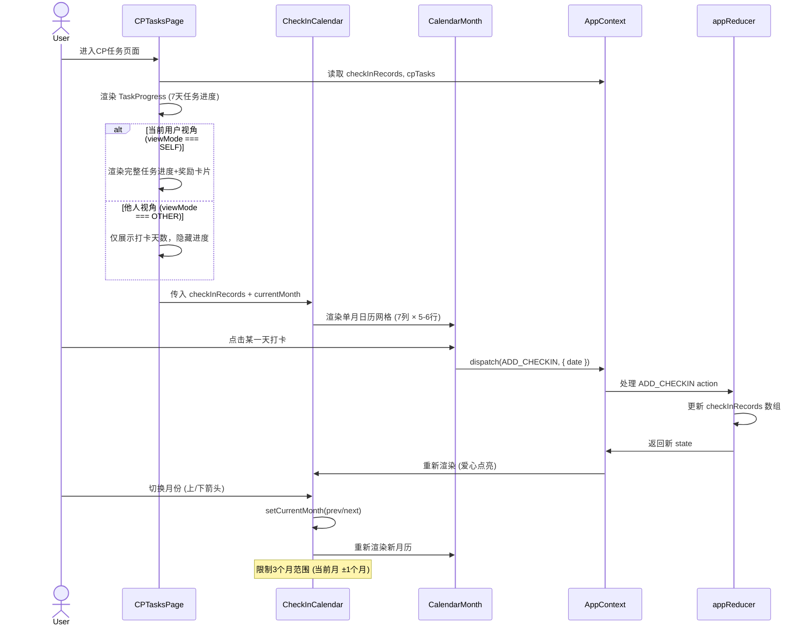
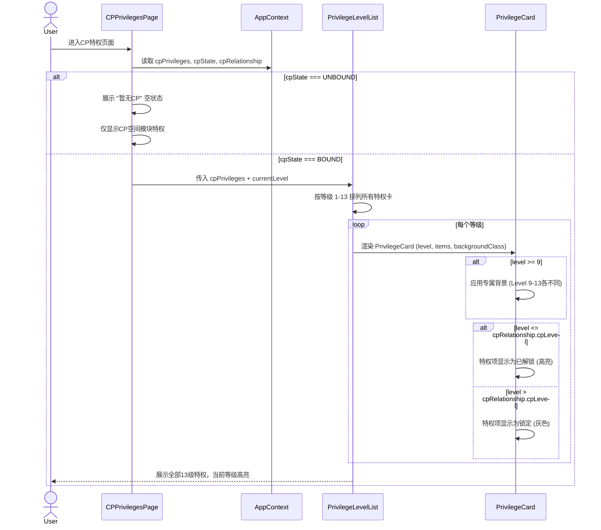
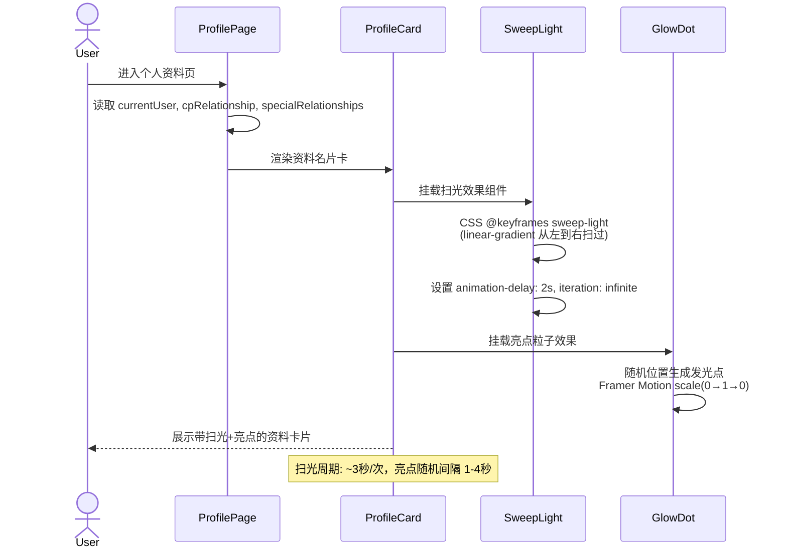
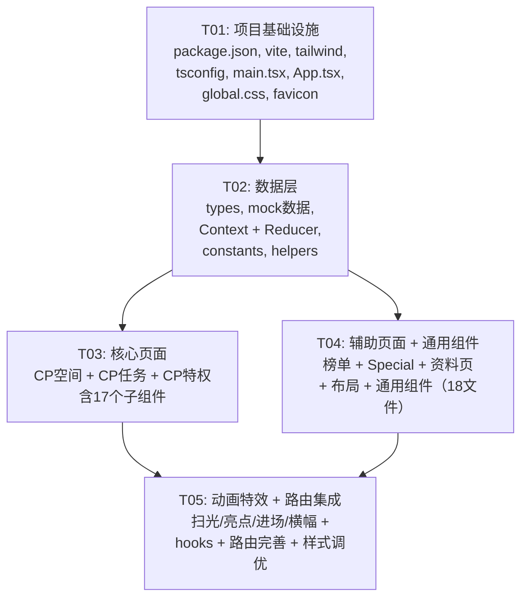

# CP Demo 系统设计文档

## Part A: 系统设计

---

### 1. 实现方案

#### 核心难点分析

| 难点 | 说明 | 方案 |
|------|------|------|
| **多状态切换** | CP空间有未绑定/已绑定两种大状态，每种状态下有多个子视图；特权页需区分已绑定/未绑定；他人视角需隐藏部分功能 | 使用 React Context + useReducer 管理全局用户状态（当前用户角色、CP绑定状态），各页面通过 Context 读取状态条件渲染 |
| **循环滚动动画** | 礼物赠送记录（3秒/条上下滚动）、CP升级记录（左右循环播放） | 使用 Framer Motion `animate` + CSS `overflow:hidden` 实现无缝循环滚动，通过 `key` 触发重置 |
| **扫光+亮点效果** | 资料名片卡需实现金属光泽扫过效果 | 使用 CSS `linear-gradient` + `@keyframes` 实现伪元素扫光动画，配合 `background-clip` 技术 |
| **日历打卡墙** | 三个月日历展示，含爱心点亮效果 | 自建日历组件（按周行排列，MUI Grid），爱心图标通过 `@mui/icons-material/Favorite` 实现点亮/未点亮两种样式 |
| **等级勋章体系** | 1-8级基础勋章、9-12级带数字勋章、成就勋章、打卡勋章等多套勋章 | 统一 `CPBadge` 组件，通过 `level`/`type` props 切换不同样式资源 |
| **响应式移动端** | 优先 390×844 视口比例 | Tailwind `sm/md/lg` 断点 + MUI `useMediaQuery`，核心布局以 390px 宽度为基准设计 |

#### 架构模式

采用 **Container-Presenter 模式**（轻量 MVC）：

```
┌─────────────────────────────────────────┐
│              App.tsx                      │
│  ┌─────────────────────────────────────┐ │
│  │       AppProvider (Context)          │ │
│  │  ┌─────────────┐ ┌───────────────┐  │ │
│  │  │  AppState   │ │  AppDispatch  │  │ │
│  │  └─────────────┘ └───────────────┘  │ │
│  └─────────────────────────────────────┘ │
│  ┌─────────────────────────────────────┐ │
│  │         React Router                 │ │
│  │  ┌────┐ ┌────┐ ┌────┐ ┌────┐ ┌───┐ │ │
│  │  │CP  │ │CP  │ │CP  │ │CP  │ │Sp │ │ │
│  │  │空  │ │任  │ │特  │ │榜  │ │ec │ │ │
│  │  │间  │ │务  │ │权  │ │单  │ │ial│ │ │
│  │  └────┘ └────┘ └────┘ └────┘ └───┘ │ │
│  └─────────────────────────────────────┘ │
│  ┌─────────────────────────────────────┐ │
│  │         共享组件层                    │ │
│  │  (Badge, Card, Avatar, Modal...)    │ │
│  └─────────────────────────────────────┘ │
└─────────────────────────────────────────┘
```

#### 框架与库选型

| 类别 | 选型 | 版本 | 理由 |
|------|------|------|------|
| 构建工具 | Vite | ^5.x | 快速HMR，TypeScript原生支持 |
| UI框架 | React | ^18.x | 需求指定 |
| 类型系统 | TypeScript | ^5.x | 类型安全 |
| 组件库 | MUI | ^5.15.x | 需求指定，丰富的移动端适配组件 |
| 样式 | Tailwind CSS | ^3.4.x | 原子化样式，快速开发 |
| 路由 | React Router | ^6.x | SPA路由 |
| 动画 | Framer Motion | ^11.x | 声明式动画API，支持手势 |
| 图标 | @mui/icons-material | ^5.15.x | MUI配套图标库 |

---

### 2. 文件列表

```
D:\code\cp-demo2\
├── index.html
├── package.json
├── vite.config.ts
├── tsconfig.json
├── tsconfig.node.json
├── tailwind.config.ts
├── postcss.config.js
│
├── public/
│   └── favicon.svg
│
└── src/
    ├── main.tsx
    ├── App.tsx
    ├── vite-env.d.ts
    │
    ├── types/
    │   └── index.ts                    # 所有TypeScript类型定义
    │
    ├── data/
    │   ├── mockUser.ts                 # 模拟用户数据
    │   ├── mockCP.ts                   # 模拟CP关系数据
    │   ├── mockSpecial.ts              # 模拟Special关系数据
    │   ├── mockRanking.ts             # 模拟榜单数据
    │   ├── mockPrivileges.ts          # 模拟特权数据
    │   └── mockTasks.ts               # 模拟任务数据
    │
    ├── context/
    │   ├── AppContext.tsx              # React Context 定义与 Provider
    │   └── appReducer.ts              # useReducer action/reducer
    │
    ├── utils/
    │   ├── constants.ts               # 颜色、等级阈值、动画参数等常量
    │   └── helpers.ts                 # 工具函数（日期格式化、等级计算等）
    │
    ├── hooks/
    │   ├── useAppState.ts             # 便捷获取Context的hook
    │   └── useScrollAnimation.ts      # 循环滚动动画hook
    │
    ├── styles/
    │   └── global.css                  # Tailwind指令 + 全局CSS变量 + 关键帧动画
    │
    ├── components/
    │   ├── layout/
    │   │   ├── BottomNav.tsx           # 底部导航栏
    │   │   ├── PageContainer.tsx       # 页面容器（含安全区域padding）
    │   │   └── TopBar.tsx              # 顶部标题栏
    │   │
    │   ├── common/
    │   │   ├── UserAvatar.tsx          # 用户头像（含CP框装饰）
    │   │   ├── LevelBadge.tsx          # 等级勋章（1-13级）
    │   │   ├── AchievementBadge.tsx    # 成就勋章
    │   │   ├── GiftItem.tsx            # 礼物条目
    │   │   ├── ProfileCard.tsx         # 资料名片卡（含扫光效果）
    │   │   ├── EmptyState.tsx          # 空状态占位
    │   │   └── ModalWrapper.tsx        # 通用弹窗容器
    │   │
    │   ├── effects/
    │   │   ├── SweepLight.tsx          # 扫光效果组件
    │   │   ├── GlowDot.tsx             # 亮点粒子效果
    │   │   ├── EntranceEffect.tsx      # 双人进场特效
    │   │   └── GiftBanner.tsx          # 顶部送礼横幅
    │   │
    │   ├── cp-space/
    │   │   ├── UnboundView.tsx         # 未绑定CP视图
    │   │   ├── BoundView.tsx           # 已绑定CP视图
    │   │   ├── GiftScrollList.tsx      # 礼物赠送记录循环滚动
    │   │   ├── CoupleAvatarGroup.tsx   # 双方头像+勋章组合
    │   │   ├── AchievementRow.tsx      # 成就勋章行（一排5个）
    │   │   ├── MemoryList.tsx          # CP记忆列表
    │   │   ├── UpgradeScroll.tsx       # 升级记录循环播放
    │   │   └── CPRulesModal.tsx        # CP规则弹窗
    │   │
    │   ├── cp-tasks/
    │   │   ├── TaskProgress.tsx        # 7天任务进度
    │   │   ├── TaskRewardCard.tsx      # 任务奖励卡片
    │   │   ├── CheckInCalendar.tsx     # 打卡日历组件
    │   │   └── CalendarMonth.tsx       # 单月日历网格
    │   │
    │   ├── cp-privileges/
    │   │   ├── PrivilegeCard.tsx       # 单级特权卡片
    │   │   └── PrivilegeLevelList.tsx  # 特权等级列表
    │   │
    │   ├── cp-ranking/
    │   │   ├── RankingList.tsx         # 榜单列表
    │   │   └── RankingItem.tsx         # 榜单条目
    │   │
    │   └── special/
    │       ├── SpecialTypeCard.tsx     # Bestie/Soulmate/Homie类型卡片
    │       ├── SpecialGiftModal.tsx    # 送SPECIAL礼物弹窗
    │       └── SpecialRelationList.tsx # 关系列表
    │
    └── pages/
        ├── CPSpacePage.tsx            # CP空间页面（组装UnboundView/BoundView）
        ├── CPTasksPage.tsx            # CP任务页面
        ├── CPPrivilegesPage.tsx       # CP特权页面
        ├── CPRankingPage.tsx          # CP打卡榜单页面
        ├── SpecialPage.tsx            # Special关系页面
        └── ProfilePage.tsx            # 个人资料页面（含他人视角模式）
```

**文件总计：56 个文件**（含配置和入口文件）

---

### 3. 数据结构与接口设计



---

### 4. 程序调用流程

#### 4.1 用户进入CP空间页面（已绑定/未绑定状态切换）



#### 4.2 打卡日历交互流程



#### 4.3 特权页面查看流程



#### 4.4 个人资料页扫光效果流程



---

### 5. 待明确事项

| # | 问题 | 当前假设 |
|---|------|----------|
| 1 | CP礼物赠送记录的具体数据格式（礼物图标、名称来源） | 使用Mock SVG图标 + 中文名称 |
| 2 | Level 9-13 专属背景的具体视觉设计稿 | 各等级使用不同渐变色：L9紫金、L10暗金、L11炫彩、L12星辉、L13彩虹 |
| 3 | "双人进场特效"触发时机和动画时长 | 模拟"进入房间"按钮触发，约2.5秒动画 |
| 4 | CP证书每个等级的具体样式差异 | 等级越高边框/底纹越华丽，统一模板+等级参数 |
| 5 | 底部导航的Tab数量和顺序 | 4个Tab：CP空间、任务、特权、Special（榜单在CP空间内入口） |
| 6 | 是否需要暗色模式 | 当前仅设计亮色粉紫主题，不支持暗色 |

---

## Part B: 任务分解

---

### 6. 依赖包列表

```
- react@^18.3.1                    # UI框架
- react-dom@^18.3.1                # React DOM渲染
- @types/react@^18.3.1             # React类型定义
- @types/react-dom@^18.3.1         # ReactDOM类型定义
- typescript@^5.5.0                # TypeScript编译器
- vite@^5.4.0                      # 构建工具
- @vitejs/plugin-react@^4.3.0      # Vite React插件
- @mui/material@^5.15.20           # MUI组件库
- @mui/icons-material@^5.15.20     # MUI图标库
- @emotion/react@^11.13.0          # MUI依赖：CSS-in-JS
- @emotion/styled@^11.13.0         # MUI依赖：styled组件
- react-router-dom@^6.26.0         # SPA路由
- framer-motion@^11.5.0            # 动画库
- tailwindcss@^3.4.10             # 原子化CSS框架
- postcss@^8.4.41                  # CSS后处理器
- autoprefixer@^10.4.20            # CSS自动前缀
```

---

### 7. 任务列表（按依赖排序）

#### T01：项目基础设施搭建

- **Task ID**: T01
- **Task Name**: 项目基础设施搭建
- **Source Files**:
  - `package.json` — 项目配置与依赖声明
  - `vite.config.ts` — Vite构建配置
  - `tsconfig.json` — TypeScript编译配置
  - `tsconfig.node.json` — Node端TS配置
  - `tailwind.config.ts` — Tailwind主题配置（粉紫色系、动画参数）
  - `postcss.config.js` — PostCSS插件配置
  - `index.html` — 入口HTML
  - `src/vite-env.d.ts` — Vite类型声明
  - `src/main.tsx` — React入口，挂载App
  - `src/App.tsx` — 根组件：Provider + Router + 路由表
  - `src/styles/global.css` — Tailwind指令 + CSS变量 + 全局关键帧动画
  - `public/favicon.svg` — 网站图标
- **Dependencies**: 无
- **Priority**: P0

---

#### T02：数据层（类型定义 + Mock数据 + 全局状态 + 工具函数）

- **Task ID**: T02
- **Task Name**: 数据层：类型定义、Mock数据、全局状态管理
- **Source Files**:
  - `src/types/index.ts` — 所有TS类型/接口/枚举定义
  - `src/data/mockUser.ts` — 模拟用户数据（当前用户 + 访客用户）
  - `src/data/mockCP.ts` — 模拟CP关系数据（含已绑定/未绑定两套）
  - `src/data/mockSpecial.ts` — 模拟Special关系数据
  - `src/data/mockRanking.ts` — 模拟榜单数据
  - `src/data/mockPrivileges.ts` — 模拟13级特权数据
  - `src/data/mockTasks.ts` — 模拟7天任务 + 打卡记录数据
  - `src/context/AppContext.tsx` — React Context定义 + Provider组件
  - `src/context/appReducer.ts` — useReducer: 全部action + reducer逻辑
  - `src/utils/constants.ts` — 常量：颜色值、等级阈值、动画时长
  - `src/utils/helpers.ts` — 工具函数：日期格式化、等级计算
- **Dependencies**: T01（需要 tsconfig 和 package.json 就绪）
- **Priority**: P0

---

#### T03：核心页面（CP空间 + CP任务 + CP特权）及其子组件

- **Task ID**: T03
- **Task Name**: 核心页面组件开发（CP空间、CP任务、CP特权）
- **Source Files**:
  - `src/pages/CPSpacePage.tsx` — CP空间主页面（状态分发）
  - `src/pages/CPTasksPage.tsx` — CP任务页面
  - `src/pages/CPPrivilegesPage.tsx` — CP特权页面
  - `src/components/cp-space/UnboundView.tsx` — 未绑定CP视图
  - `src/components/cp-space/BoundView.tsx` — 已绑定CP视图
  - `src/components/cp-space/GiftScrollList.tsx` — 礼物赠送记录循环滚动
  - `src/components/cp-space/CoupleAvatarGroup.tsx` — 双方头像+勋章组合
  - `src/components/cp-space/AchievementRow.tsx` — 成就勋章行
  - `src/components/cp-space/MemoryList.tsx` — CP记忆列表
  - `src/components/cp-space/UpgradeScroll.tsx` — 升级记录循环播放
  - `src/components/cp-space/CPRulesModal.tsx` — CP规则弹窗
  - `src/components/cp-tasks/TaskProgress.tsx` — 7天任务进度条
  - `src/components/cp-tasks/TaskRewardCard.tsx` — 任务奖励卡片（气泡/座驾/勋章）
  - `src/components/cp-tasks/CheckInCalendar.tsx` — 打卡日历主组件
  - `src/components/cp-tasks/CalendarMonth.tsx` — 单月日历网格
  - `src/components/cp-privileges/PrivilegeCard.tsx` — 单级特权卡片
  - `src/components/cp-privileges/PrivilegeLevelList.tsx` — 特权等级列表容器
- **Dependencies**: T02（需要类型定义、Mock数据、Context状态）
- **Priority**: P0

---

#### T04：辅助页面 + 通用组件 + 布局组件

- **Task ID**: T04
- **Task Name**: 辅助页面与通用组件开发（榜单、Special、资料页、布局）
- **Source Files**:
  - `src/pages/CPRankingPage.tsx` — CP打卡榜单页面
  - `src/pages/SpecialPage.tsx` — Special关系页面
  - `src/pages/ProfilePage.tsx` — 个人资料页面（含他人视角）
  - `src/components/layout/BottomNav.tsx` — 底部导航栏
  - `src/components/layout/PageContainer.tsx` — 页面容器
  - `src/components/layout/TopBar.tsx` — 顶部标题栏
  - `src/components/common/UserAvatar.tsx` — 用户头像（含CP框装饰）
  - `src/components/common/LevelBadge.tsx` — 等级勋章（1-13级）
  - `src/components/common/AchievementBadge.tsx` — 成就勋章
  - `src/components/common/GiftItem.tsx` — 礼物条目
  - `src/components/common/ProfileCard.tsx` — 资料名片卡（含扫光）
  - `src/components/common/EmptyState.tsx` — 空状态占位
  - `src/components/common/ModalWrapper.tsx` — 通用弹窗容器
  - `src/components/cp-ranking/RankingList.tsx` — 榜单列表
  - `src/components/cp-ranking/RankingItem.tsx` — 榜单条目
  - `src/components/special/SpecialTypeCard.tsx` — Bestie/Soulmate/Homie卡片
  - `src/components/special/SpecialGiftModal.tsx` — 送SPECIAL礼物弹窗
  - `src/components/special/SpecialRelationList.tsx` — 关系列表
- **Dependencies**: T02（需要类型+数据），可部分并行于T03（通用组件可先做）
- **Priority**: P1

---

#### T05：动画特效 + Hooks + 路由集成 + 最终样式调优

- **Task ID**: T05
- **Task Name**: 动画特效实现、路由集成、整体样式调优
- **Source Files**:
  - `src/components/effects/SweepLight.tsx` — 扫光效果
  - `src/components/effects/GlowDot.tsx` — 亮点粒子效果
  - `src/components/effects/EntranceEffect.tsx` — 双人进场特效
  - `src/components/effects/GiftBanner.tsx` — 顶部送礼横幅
  - `src/hooks/useAppState.ts` — 便捷取Context的hook
  - `src/hooks/useScrollAnimation.ts` — 循环滚动动画hook
  - `src/App.tsx` — 完善路由配置（所有页面路由 + 默认重定向）
  - `src/styles/global.css` — 补充动画关键帧 + 响应式断点调优
  - `src/components/cp-space/BoundView.tsx` — 集成GiftBanner + EntranceEffect
  - `src/components/common/ProfileCard.tsx` — 集成SweepLight + GlowDot
- **Dependencies**: T03, T04（页面和组件就绪后才做动画集成和路由完善）
- **Priority**: P2

---

### 8. 共享知识

#### 色彩体系（CSS变量）
```css
:root {
  --cp-primary: #E91E8C;          /* 主色：粉紫 */
  --cp-primary-light: #F8BBD0;    /* 浅粉 */
  --cp-primary-dark: #AD1457;     /* 深粉 */
  --cp-accent: #FF6B9D;           /* 强调色 */
  --cp-gold: #FFD700;             /* 金色（高等级） */
  --cp-platinum: #C0C0C0;         /* 白金色 */
  --cp-rainbow: linear-gradient(90deg, #FF6B6B, #FFD93D, #6BCB77, #4D96FF, #9B59B6);

  /* 各级别专属色 */
  --cp-lv1-8: linear-gradient(135deg, #FFB6C1, #FFC0CB);
  --cp-lv9: linear-gradient(135deg, #E8C3A0, #D4A574);       /* 紫金 */
  --cp-lv10: linear-gradient(135deg, #C9A96E, #A68A4F);      /* 暗金 */
  --cp-lv11: linear-gradient(135deg, #FF6B6B, #FFD93D, #6BCB77, #4D96FF, #9B59B6); /* 炫彩 */
  --cp-lv12: linear-gradient(135deg, #2C3E50, #3498DB, #E0E6ED);                   /* 星辉 */
  --cp-lv13: linear-gradient(135deg, #FF0080, #FF8C00, #40E0D0, #8B00FF);           /* 彩虹 */
}
```

#### 通用约定
- 所有日期使用 ISO 8601 字符串格式 (`YYYY-MM-DD`)
- 组件文件命名：PascalCase（如 `CPSpacePage.tsx`）
- 工具函数使用 camelCase（如 `formatDate`）
- CSS类名优先使用 Tailwind 原子类，自定义样式用 `style` prop 或 CSS Module
- 图片资源全部使用 SVG 内联或占位URL（Mock阶段），不引入外部图片
- 动画时长统一用 Framer Motion `duration` 参数，不使用硬编码CSS时间
- 底部导航固定4个Tab：💕CP空间、📋任务、👑特权、✨Special
- 移动端优先设计宽度：390px（基准），使用 Tailwind `max-w-[390px] mx-auto` 包裹桌面端

#### 状态管理约定
- 全局状态通过 `AppContext` 访问，不跨组件传递深层props
- 组件内部状态（表单输入、展开/折叠等）使用 `useState`
- 动画状态使用 Framer Motion 的 `animate` prop，不存入全局state
- Mock数据切换：在 `AppContext` Provider 初始化时通过 URL 参数 `?mode=self|other|unbound` 选择数据集

#### 组件命名约定
- 页面组件放在 `src/pages/`，以 `Page` 结尾
- 功能组件放在 `src/components/<feature>/`，按功能域分组
- 通用组件放在 `src/components/common/`
- 布局组件放在 `src/components/layout/`
- 特效组件放在 `src/components/effects/`

---

### 9. 任务依赖关系图



---

> **文档版本**: v1.0  
> **作者**: Bob（架构师）  
> **日期**: 2025-07-02
