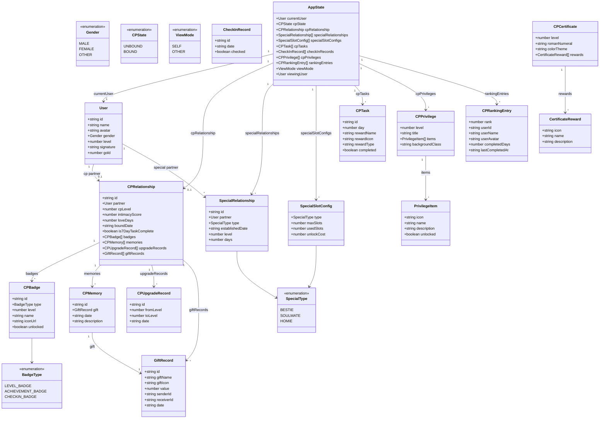
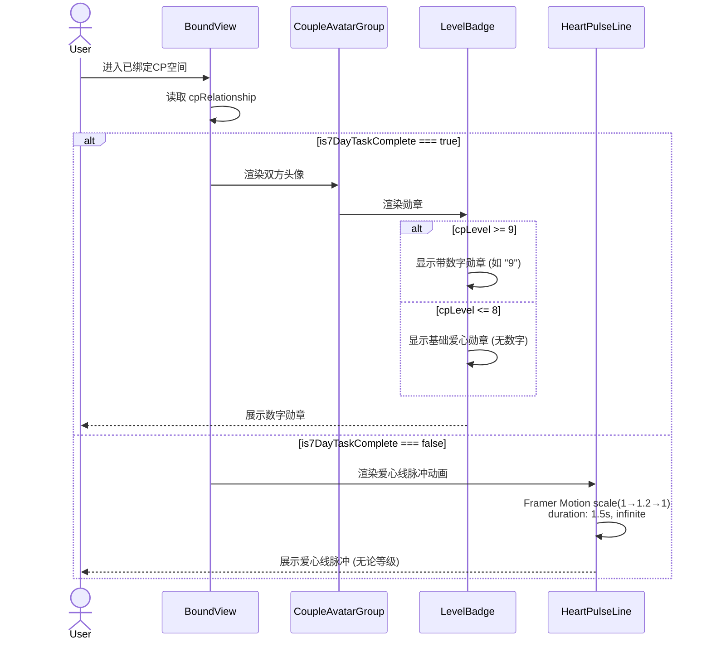
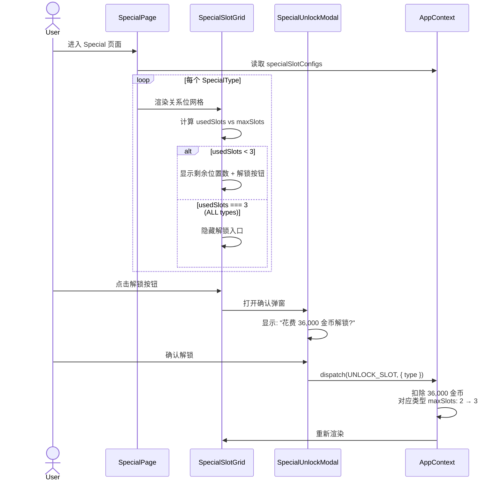
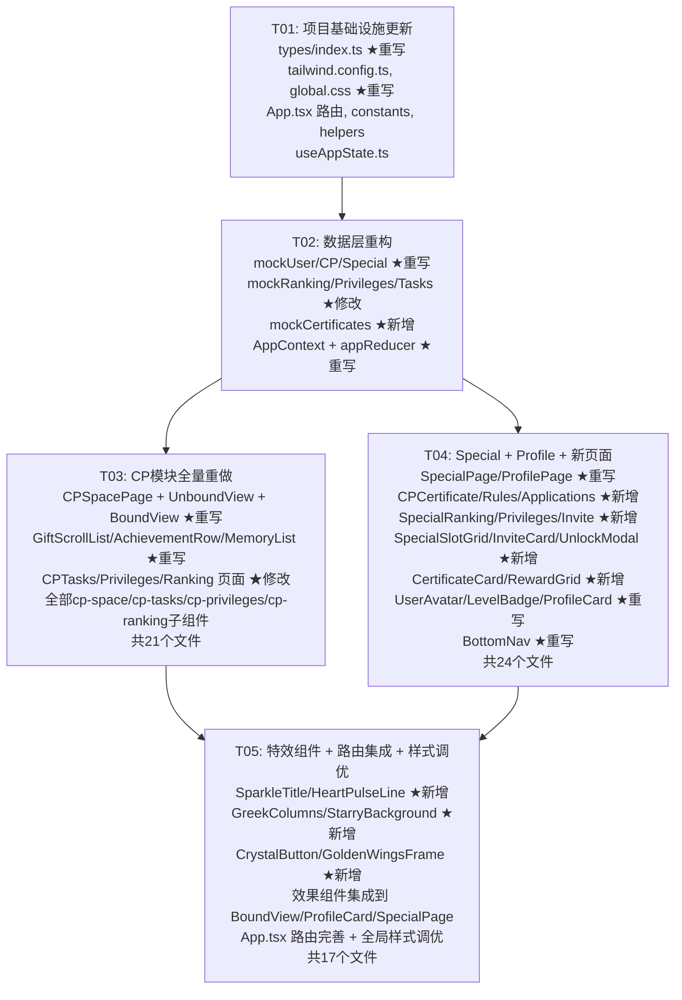

# CP Demo v2 — 增量架构设计方案

> **文档版本**: v2.0  
> **作者**: 高见远（架构师）  
> **日期**: 2025-07-02  
> **基于**: PRD-v2 + 现有 system_design.md (v1.0) + 当前代码实现  
> **技术栈**: Vite + React 18 + TypeScript + MUI 5 + Tailwind CSS 3 + React Router 6 + Framer Motion 11

---

## Part A: 增量设计

---

### 1. 现有实现评估（差距分析）

#### 1.1 类型系统差距（`src/types/index.ts`）

| 维度 | 当前实现 | PRD-v2 要求 | 差距等级 |
|------|---------|------------|:---:|
| **User** | `id, name, avatar, level, isVip, bio, tags` | `id, name, avatar, gender, level, signature, gold` | 🔴 大 |
| **CPRelationship** | `user1/user2, status, level, totalDays, intimacy, achievements, giftCount` | `partner: User, cpLevel, intimacyScore, loveDays, boundDate, is7DayTaskComplete, badges[], memories[], upgradeRecords[], giftRecords[]` | 🔴 大 |
| **SpecialRelationship** | `type, name, friendName, friendAvatar, level, days, lastInteraction, description, gifts` | `partner: User, type, establishedDate, level, days` | 🔴 大 |
| **AppState** | `mode, currentUser, visitorUser, cpRelationship, tasks, checkInRecords, privileges, rankings, specialRelationships, giftRecords` | `currentUser, cpState, cpRelationship, specialRelationships, specialSlotConfigs[], cpTasks[], checkInRecords[], cpPrivileges[], rankingEntries[], viewMode, viewingUser` | 🔴 大 |
| **枚举类型** | 使用 `type` 别名（`'bestie' | 'soulmate' | 'homie'`） | 需新增 `Gender`, `BadgeType` 枚举；保留 string union 作为轻量方案 | 🟡 中 |
| **Missing Types** | 无 | `SpecialSlotConfig`, `CPCertificate`, `CPState`, `ViewMode` (重构) | 🔴 大 |

#### 1.2 页面/路由差距（`src/App.tsx`）

| 当前路由 | PRD-v2 要求 | 状态 |
|---------|------------|:---:|
| `/cp-space` | `/cp-space` | 🟢 保留 |
| `/cp-tasks` | `/cp-tasks` | 🟢 保留 |
| `/cp-privileges` | `/cp-privileges` | 🟢 保留 |
| `/cp-ranking` | `/cp-ranking` | 🟢 保留 |
| `/special` | `/special` | 🟢 保留 |
| `/profile` | `/profile` | 🟢 保留 |
| — | `/cp-rules` | 🔴 新增 |
| — | `/cp-applications` | 🔴 新增 |
| — | `/cp-certificate` | 🔴 新增 |
| — | `/special-ranking` | 🔴 新增 |
| — | `/special-privileges` | 🔴 新增 |
| — | `/special-invite` | 🔴 新增 |

#### 1.3 视觉风格差距

| 维度 | 当前实现 | PRD-v2 要求 | 差距等级 |
|------|---------|------------|:---:|
| **CP 空间背景** | 简单粉白渐变 `#FFF0F5 → #fafafa` | 粉紫星空渐变 + 金色希腊柱廊 + 粉色帷幕 | 🔴 大 |
| **Special 标题** | 普通文字标题 | 紫粉渐变 + 动态闪光字母动画 | 🔴 大 |
| **个人资料** | 简单统计卡片（3列数字） | CP 关系卡 + Special 9 格网格 | 🔴 大 |
| **头像框** | 无特殊头像框 | 金色翅膀+皇冠(CP)，蓝/紫/金边框(Special) | 🔴 大 |
| **按钮样式** | 标准 MUI 渐变按钮 | 水晶质感(Ranking/Privilege)、金色边框(Invite CP) | 🔴 大 |
| **勋章体系** | 简单 emoji 勋章列表 | 1-8级爱心(无数字)、9-12级数字勋章、爱心线脉冲(未完成7日) | 🔴 大 |
| **等级背景** | 粉红系梯度（所有等级） | Lv9+ 每个等级专属背景（蓝星空/金/彩虹/紫星空/极光） | 🟡 中 |

#### 1.4 功能模块差距

| 模块 | 当前实现 | PRD-v2 差距 |
|------|---------|------------|
| **CP 礼物滚动** | 仅在 UnboundView 中有简单实现 | 需 3 排展示、3 个月内历史、上下循环 3 秒/条 |
| **CP 打卡日历** | 基础月视图 | 需真实日历网格、爱心点亮、3 个月内切换 |
| **CP 成就勋章行** | 一排 5 个成就 | 需累计展示历史等级勋章（如 Lv7 展示 Lv1-Lv7 共 7 个） |
| **CP 记忆列表** | 简单卡片列表 | 按礼物价值排序、每行 4 个礼物卡片 + 数量标签 |
| **CP 证书** | 不存在 | 全新页面：每等级独立、罗马数字+翅膀+皇冠、3×4 奖励网格 |
| **Special 关系位** | 简单列表 | 每种类型限绑 3 人、默认 2 位、36000 金币解锁额外位 |
| **Special 邀请** | 不存在 | 全新页面：输入 ID + 选择关系类型 |
| **CP 规则页** | 仅 Modal 弹窗 | 需独立页面 `/cp-rules`（保留原 Modal） |
| **CP 申请记录** | 不存在 | 需独立页面 `/cp-applications` |

#### 1.5 数据/状态管理差距

| 维度 | 当前实现 | PRD-v2 要求 |
|------|---------|------------|
| **ViewMode** | `'self' | 'other' | 'unbound'` | 需拆分为 `viewMode` + `cpState` 两个独立维度 |
| **他人视角** | `visitorUser` 字段 | 需 `viewingUser` + 完整他人 CP 数据 |
| **SpecialSlotConfig** | 不存在 | 新增 `maxSlots/usedSlots/unlockCost` 配置 |
| **User.gold** | 不存在 | 新增金币字段 |
| **CPRelationship.is7DayTaskComplete** | 不存在 | 新增 7 日任务完成标记 |

---

### 2. 增量设计方案

#### 2.1 需要完全重写的文件（REWRITE）

这些文件的现有内容与 PRD-v2 差距过大，需要完全替换：

```
src/types/index.ts                          # 类型系统全量重构（所有接口/枚举对齐 PRD-v2）
src/context/AppContext.tsx                  # Provider + 初始化逻辑重写（新 state 结构）
src/context/appReducer.ts                   # Reducer 重写（新 action 类型）
src/pages/CPSpacePage.tsx                  # CP 空间（豪华主题 + Tab 系统 + GiftScroll 集成）
src/pages/ProfilePage.tsx                  # 个人资料（CP 关系卡 + Special 9 格网格）
src/pages/SpecialPage.tsx                  # Special 主页（动态闪光标题 + 关系位系统）
src/components/cp-space/BoundView.tsx       # 已绑定视图（全新华丽背景 + 勋章体系）
src/components/cp-space/UnboundView.tsx     # 未绑定视图（希腊柱廊 + 水晶按钮 + Invite CP 弹窗）
src/components/cp-space/GiftScrollList.tsx  # 3 排循环滚动（3 秒/条）
src/components/cp-space/AchievementRow.tsx  # 历史累计勋章行（一排 5 个）
src/components/cp-space/MemoryList.tsx      # 按价值排序、每行 4 个礼物卡片
src/components/layout/BottomNav.tsx         # 更新导航项
src/components/common/UserAvatar.tsx        # 新增头像框（翅膀皇冠 CP / 蓝紫金 Special）
src/components/common/LevelBadge.tsx        # 1-8 级爱心 / 9-12 级数字 / 爱心线脉冲
src/components/common/ProfileCard.tsx       # 重做为 CP 关系卡（蓝 Bestie / 紫 Soulmate / 金 Homie）
src/styles/global.css                       # 大量新 CSS 变量 + 关键帧动画
tailwind.config.ts                           # 新增 Special 色系 + 动画配置
```

#### 2.2 需要部分修改的文件（MODIFY）

这些文件保留骨架，增量修改以适配新数据模型和视觉：

```
src/App.tsx                                 # 新增 6 条路由 + 修改 lazy import
src/utils/constants.ts                      # 新增等级背景、Special 色系、勋章常量
src/utils/helpers.ts                        # 新增金币格式化、罗马数字转换、关系类型映射
src/data/mockUser.ts                        # User 增加 gold/gender/signature 字段
src/data/mockCP.ts                          # CPRelationship 结构重组
src/data/mockSpecial.ts                     # SpecialRelationship 重构 + 新增 mockSlotConfigs
src/data/mockRanking.ts                     # 对齐新 CPRankingEntry 结构
src/data/mockPrivileges.ts                  # 增加 backgroundClass 字段
src/data/mockTasks.ts                       # 对齐新 CPTask 结构，增加 rewardType 映射
src/pages/CPTasksPage.tsx                   # 打卡日历增强（真实日历网格）
src/pages/CPPrivilegesPage.tsx              # 适配新 CPPrivilege 类型
src/pages/CPRankingPage.tsx                 # 适配新 CPRankingEntry 类型
src/hooks/useAppState.ts                    # 适配新 AppState 结构
src/components/cp-tasks/CheckInCalendar.tsx # 真实日历网格（7列 × 5-6行）
src/components/cp-tasks/CalendarMonth.tsx   # 爱心点亮逻辑
src/components/cp-privileges/PrivilegeCard.tsx    # 适配新类型 + Level 9+ 背景切换
src/components/cp-privileges/PrivilegeLevelList.tsx # 适配新类型
src/components/cp-ranking/RankingList.tsx   # 适配新 CPRankingEntry
src/components/cp-ranking/RankingItem.tsx   # 适配新 CPRankingEntry
src/components/common/GiftItem.tsx          # 礼物卡片模式（每行 4 个 + 数量标签）
src/components/common/EmptyState.tsx        # 新增 CP 未绑定专用空状态变体
src/components/common/ModalWrapper.tsx      # 适配新主题色
```

#### 2.3 需要新增的文件（ADD）

```
# ── 新页面 ──
src/pages/CPCertificatePage.tsx             # CP 证书页面（每等级独立、罗马数字+翅膀+皇冠）
src/pages/CPRulesPage.tsx                   # CP 规则独立页面
src/pages/CPApplicationsPage.tsx            # CP 申请记录页面
src/pages/SpecialRankingPage.tsx            # Special 榜单页面
src/pages/SpecialPrivilegesPage.tsx         # Special 特权页面
src/pages/SpecialInvitePage.tsx             # Special 邀请/结缘页面

# ── 新组件 ──
src/components/cp-certificate/
  CertificateCard.tsx                       # 证书卡片主体（双人头像+罗马数字+翅膀+皇冠）
  CertificateRewardGrid.tsx                 # 3×4 奖励网格

src/components/special/
  SpecialSlotGrid.tsx                       # Special 9 格网格（3 类型 × 3 位置）
  SpecialInviteCard.tsx                     # 邀请卡片（输入 ID + 选择类型）
  SpecialUnlockModal.tsx                    # 关系位解锁确认弹窗

src/components/common/
  CrystalButton.tsx                         # 水晶质感按钮（Ranking/Privilege 专用）
  GoldenWingsFrame.tsx                      # 金色翅膀+皇冠头像框

src/components/effects/
  SparkleTitle.tsx                          # 动态闪光字母标题（Special 页）
  HeartPulseLine.tsx                        # 心形脉冲连线动画（未完成 7 日任务）
  GreekColumns.tsx                          # 金色希腊柱廊装饰背景
  StarryBackground.tsx                      # 粉紫星空渐变背景

# ── 新数据 ──
src/data/mockCertificates.ts               # CP 证书 Mock 数据（Lv1-Lv13）
```

#### 2.4 可以保留不变的文件（KEEP）

这些文件无需改动或仅需极小调整（如 import 路径）：

```
# 配置文件
index.html, package.json, vite.config.ts, tsconfig.json, tsconfig.node.json, postcss.config.js, public/favicon.svg

# 入口
src/main.tsx, src/vite-env.d.ts

# 布局（保留结构）
src/components/layout/TopBar.tsx
src/components/layout/PageContainer.tsx

# 效果组件（保留）
src/components/effects/SweepLight.tsx
src/components/effects/GlowDot.tsx
src/components/effects/EntranceEffect.tsx
src/components/effects/GiftBanner.tsx

# 部分 cp-space 子组件（保留）
src/components/cp-space/CoupleAvatarGroup.tsx   # 需微调 props
src/components/cp-space/UpgradeScroll.tsx        # 保留
src/components/cp-space/CPRulesModal.tsx          # 保留为可选 Modal

# 任务组件（保留结构）
src/components/cp-tasks/TaskProgress.tsx
src/components/cp-tasks/TaskRewardCard.tsx

# Special 子组件（保留）
src/components/special/SpecialTypeCard.tsx
src/components/special/SpecialGiftModal.tsx

# Hooks（保留）
src/hooks/useScrollAnimation.ts

# 通用组件（保留）
src/components/common/AchievementBadge.tsx
```

---

### 3. 组件树重设计

```
App.tsx
├── ThemeProvider (MUI)
│   └── CssBaseline
│       └── AppProvider (Context + Reducer)
│           └── BrowserRouter
│               └── PageContainer (max-w-[390px] + safe-area)
│                   ├── <Routes>
│                   │   ├── / → Navigate → /cp-space
│                   │   │
│                   │   ├── /cp-space → CPSpacePage
│                   │   │   ├── StarryBackground          # 粉紫星空渐变背景
│                   │   │   ├── GreekColumns              # 金色希腊柱廊装饰
│                   │   │   ├── [cpState=UNBOUND] → UnboundView
│                   │   │   │   ├── CoupleAvatarGroup     # 一方头像+空位
│                   │   │   │   │   └── GoldenWingsFrame  # 金色翅膀皇冠框
│                   │   │   │   ├── CrystalButton ×2      # 榜单/特权
│                   │   │   │   ├── GiftScrollList        # 3排滚动
│                   │   │   │   ├── Button(Invite CP)     # 金色边框按钮
│                   │   │   │   │   └── ModalWrapper      # 邀请弹窗
│                   │   │   │   └── Button(Rules/Apply)
│                   │   │   │
│                   │   │   └── [cpState=BOUND] → BoundView
│                   │   │       ├── GiftBanner            # 顶部送礼横幅
│                   │   │       ├── CoupleAvatarGroup     # 双方头像+勋章
│                   │   │       │   ├── GoldenWingsFrame ×2
│                   │   │       │   └── LevelBadge        # 勋章(1-12级)
│                   │   │       ├── HeartPulseLine        # 未完成7日→脉冲动画
│                   │   │       ├── DataPanel             # Love Days + Intimacy
│                   │   │       ├── AchievementRow        # 成就勋章行(5个/排)
│                   │   │       │   └── AchievementBadge[]
│                   │   │       ├── MemoryList            # 记忆网格(4个/行)
│                   │   │       │   └── GiftItem[]        # 礼物卡片+数量标签
│                   │   │       ├── GiftScrollList        # 礼物赠送滚动
│                   │   │       ├── UpgradeScroll         # 升级记录左右滚动
│                   │   │       └── CrystalButton ×2      # 榜单/特权
│                   │   │
│                   │   ├── /cp-tasks → CPTasksPage
│                   │   │   ├── TaskProgress              # 7日任务进度条
│                   │   │   │   └── TaskRewardCard[]      # 3/5/7天奖励
│                   │   │   └── CheckInCalendar           # 打卡日历
│                   │   │       └── CalendarMonth[]       # 3个月日历网格
│                   │   │
│                   │   ├── /cp-privileges → CPPrivilegesPage
│                   │   │   └── PrivilegeLevelList        # 1-13级列表
│                   │   │       └── PrivilegeCard[]        # 单级卡片+背景
│                   │   │
│                   │   ├── /cp-ranking → CPRankingPage
│                   │   │   └── RankingList
│                   │   │       └── RankingItem[]
│                   │   │
│                   │   ├── /cp-rules → CPRulesPage       # [NEW]
│                   │   │
│                   │   ├── /cp-applications → CPApplicationsPage  # [NEW]
│                   │   │
│                   │   ├── /cp-certificate → CPCertificatePage  # [NEW]
│                   │   │   ├── CertificateCard           # 证书主卡
│                   │   │   │   ├── GoldenWingsFrame ×2
│                   │   │   │   └── 罗马数字等级
│                   │   │   └── CertificateRewardGrid     # 3×4奖励网格
│                   │   │
│                   │   ├── /special → SpecialPage
│                   │   │   ├── SparkleTitle              # 动态闪光字母
│                   │   │   ├── [unbound] → SpecialTypeCard[] ×3
│                   │   │   ├── [bound] → SpecialSlotGrid # 9格网格
│                   │   │   │   └── SpecialTypeCard[]
│                   │   │   ├── SpecialUnlockModal        # 解锁确认弹窗
│                   │   │   ├── CrystalButton(Ranking)
│                   │   │   └── CrystalButton(Privileges)
│                   │   │
│                   │   ├── /special-ranking → SpecialRankingPage  # [NEW]
│                   │   │   └── RankingList
│                   │   │
│                   │   ├── /special-privileges → SpecialPrivilegesPage  # [NEW]
│                   │   │
│                   │   ├── /special-invite → SpecialInvitePage  # [NEW]
│                   │   │   └── SpecialInviteCard
│                   │   │       ├── 输入用户ID
│                   │   │       └── 选择关系类型(Bestie/Soulmate/Homie)
│                   │   │
│                   │   └── /profile → ProfilePage
│                   │       ├── CP 关系卡 (ProfileCard)
│                   │       │   ├── UserAvatar (含头像框)
│                   │       │   ├── SweepLight         # 扫光效果
│                   │       │   └── GlowDot[]           # 亮点粒子
│                   │       └── Special 关系网格 (9格)
│                   │           └── SpecialTypeCard[0..9]
│                   │
│                   └── BottomNav (4 Tabs)
│                       ├── 💕 CP空间
│                       ├── 📋 任务
│                       ├── 👑 特权
│                       └── ✨ Special
│
└── 全局共享层
    ├── hooks/useAppState.ts
    ├── hooks/useScrollAnimation.ts
    ├── utils/constants.ts
    ├── utils/helpers.ts
    └── styles/global.css (CSS变量 + 关键帧)
```

---

### 4. 数据模型增量变更



---

### 5. 程序调用流程（关键新增场景）

#### 5.1 CP 勋章展示逻辑



#### 5.2 Special 关系位解锁流程



---

### 6. 待明确事项

| # | 问题 | 当前假设 | 影响范围 |
|---|------|----------|----------|
| 1 | Level 9-13 背景是否替代全局 CP 空间背景，还是仅特权卡片背景？ | 特权卡片内展示对应背景，CP 空间全局保持粉紫星空 | CP 特权卡片、BoundView |
| 2 | CP 证书 Lv9-Lv13 的具体视觉设计 | 沿用 Lv3-Lv7 颜色模板增加复杂度（冰蓝→粉→金→紫→红对应 Lv3→Lv7），Lv9+ 增加翅膀和皇冠复杂度 | CPCertificatePage |
| 3 | 希腊柱廊装饰是纯 CSS 还是需要 SVG 素材？ | 使用 CSS 渐变 + 伪元素模拟柱廊效果，不引入外部图片 | UnboundView, BoundView |
| 4 | 个人资料 Special 9 格中空格的表现形式 | 显示灰色虚线边框 + "+" 占位符 | ProfilePage, SpecialSlotGrid |
| 5 | CP 申请记录页面的具体内容格式 | Mock 数据：申请人头像+昵称+时间+状态(待处理/已通过/已拒绝) | CPApplicationsPage |
| 6 | 打卡日历是否支持跨年展示？ | 最近 3 个月（含跨年），月切换箭头支持 | CheckInCalendar |

---

## Part B: 任务分解

---

### 7. 依赖包列表

与 v1.0 基本一致，无需新增第三方包：

```
- react@^18.3.1                    # UI框架
- react-dom@^18.3.1                # React DOM渲染
- @types/react@^18.3.1             # React类型定义
- @types/react-dom@^18.3.1         # ReactDOM类型定义
- typescript@^5.5.0                # TypeScript编译器
- vite@^5.4.0                      # 构建工具
- @vitejs/plugin-react@^4.3.0      # Vite React插件
- @mui/material@^5.15.20           # MUI组件库
- @mui/icons-material@^5.15.20     # MUI图标库
- @emotion/react@^11.13.0          # MUI依赖
- @emotion/styled@^11.13.0         # MUI依赖
- react-router-dom@^6.26.0         # SPA路由
- framer-motion@^11.5.0            # 动画库
- tailwindcss@^3.4.10             # 原子化CSS框架
- postcss@^8.4.41                  # CSS后处理器
- autoprefixer@^10.4.20            # CSS自动前缀
```

---

### 8. 任务列表（按依赖排序，共 5 个任务）

#### T01：项目基础设施更新 — 类型系统 + 配置 + 样式基础

- **Task ID**: T01
- **Task Name**: 项目基础设施更新（类型系统 + 配置 + 入口 + 样式基础）
- **Source Files**:
  - `src/types/index.ts` — **重写**：全部类型/接口/枚举对齐 PRD-v2
  - `tailwind.config.ts` — **修改**：新增 Special 色系 + 动画关键帧
  - `src/styles/global.css` — **重写**：新增 CSS 变量（Special 色系、等级背景）、关键帧动画（脉冲、闪光、翅膀浮动）
  - `src/App.tsx` — **修改**：新增 6 条路由 lazy import + Route 配置
  - `src/utils/constants.ts` — **修改**：新增 SpecialSlot 常量、关系类型映射、勋章等级配置、礼物流水配置
  - `src/utils/helpers.ts` — **修改**：新增 `formatGold()`, `toRomanNumeral()`, `getSpecialTypeColor()`, `getLevelBackground()`
  - `src/hooks/useAppState.ts` — **修改**：适配新 AppState 结构，新增 `cpState`, `viewMode` 便捷访问
- **Dependencies**: 无
- **Priority**: P0

---

#### T02：数据层重构 — Mock 数据 + 全局状态管理

- **Task ID**: T02
- **Task Name**: 数据层重构（Mock 数据 + Context/Reducer + 新 Mock 数据）
- **Source Files**:
  - `src/data/mockUser.ts` — **重写**：User 增加 `gender`, `gold`, `signature`；添加 `mockViewingUser`
  - `src/data/mockCP.ts` — **重写**：CPRelationship 结构重组（partner, cpLevel, intimacyScore, loveDays, is7DayTaskComplete, giftRecords）
  - `src/data/mockSpecial.ts` — **重写**：SpecialRelationship 重构（partner: User）+ 新增 `mockSpecialSlotConfigs`
  - `src/data/mockRanking.ts` — **修改**：对齐新 CPRankingEntry 结构
  - `src/data/mockPrivileges.ts` — **修改**：增加 `backgroundClass` 字段
  - `src/data/mockTasks.ts` — **修改**：对齐新 CPTask 结构
  - `src/data/mockCertificates.ts` — **新增**：Lv1-Lv13 证书 Mock 数据
  - `src/context/AppContext.tsx` — **重写**：新 Provider（新 state 结构 + URL 参数 cpState/viewMode 解析 + Mock 数据装配）
  - `src/context/appReducer.ts` — **重写**：新 action 类型（SET_CP_STATE, SET_VIEW_MODE, SET_VIEWING_USER, COMPLETE_TASK, ADD_CHECKIN, UNLOCK_SLOT, SEND_INVITE, BIND_CP, UNBIND_CP）
- **Dependencies**: T01（需要 types、constants、helpers 就绪）
- **Priority**: P0

---

#### T03：CP 模块全量重做 — CP 空间 + CP 任务 + CP 特权 + CP 榜单

- **Task ID**: T03
- **Task Name**: CP 模块全量重做（CP 空间/任务/特权/榜单及其所有子组件）
- **Source Files**:
  - `src/pages/CPSpacePage.tsx` — **重写**：豪华主题分发（UnboundView/BoundView）+ Tab 系统
  - `src/pages/CPTasksPage.tsx` — **修改**：打卡日历增强 + 他人视角进度隐藏
  - `src/pages/CPPrivilegesPage.tsx` — **修改**：适配新类型 + 空状态
  - `src/pages/CPRankingPage.tsx` — **修改**：适配新 CPRankingEntry
  - `src/components/cp-space/UnboundView.tsx` — **重写**：粉紫星空 + 希腊柱廊 + 钻戒盒 + Invite CP 金色边框按钮 + 水晶按钮
  - `src/components/cp-space/BoundView.tsx` — **重写**：豪华背景 + 勋章体系 + 数据面板 + 成就勋章行 + 记忆网格 + 礼物滚动
  - `src/components/cp-space/GiftScrollList.tsx` — **重写**：3 排展示、3 个月内历史、上下循环 3 秒/条
  - `src/components/cp-space/AchievementRow.tsx` — **重写**：历史累计勋章行（一排 5 个，Lv7 展示 7 个勋章）
  - `src/components/cp-space/MemoryList.tsx` — **重写**：按礼物价值排序、每行 4 个 GiftItem + 数量标签
  - `src/components/cp-space/CoupleAvatarGroup.tsx` — **修改**：集成 GoldenWingsFrame + 爱心线脉冲条件渲染
  - `src/components/cp-space/UpgradeScroll.tsx` — **保留**（微调 props）
  - `src/components/cp-space/CPRulesModal.tsx` — **保留**
  - `src/components/cp-tasks/CheckInCalendar.tsx` — **修改**：真实日历网格（7 列 × 5-6 行）+ 爱心点亮
  - `src/components/cp-tasks/CalendarMonth.tsx` — **修改**：爱心视觉效果增强
  - `src/components/cp-tasks/TaskProgress.tsx` — **保留**（微调）
  - `src/components/cp-tasks/TaskRewardCard.tsx` — **保留**（微调）
  - `src/components/cp-privileges/PrivilegeCard.tsx` — **修改**：Level 9+ 专属背景应用 + 锁定/解锁样式
  - `src/components/cp-privileges/PrivilegeLevelList.tsx` — **修改**：适配新类型
  - `src/components/cp-ranking/RankingList.tsx` — **修改**：适配新 CPRankingEntry
  - `src/components/cp-ranking/RankingItem.tsx` — **修改**：适配新 CPRankingEntry
  - `src/components/common/GiftItem.tsx` — **修改**：礼物卡片模式（每行 4 个 + 数量标签）
- **Dependencies**: T02（需要新 Mock 数据和 Context 就绪）
- **Priority**: P0

---

#### T04：Special 模块 + Profile + 新页面 — Special 全流程 + 个人资料 + 证书 + 规则 + 申请

- **Task ID**: T04
- **Task Name**: Special 模块 + Profile 重做 + 新页面开发（证书/规则/申请/Special 子页）
- **Source Files**:
  - `src/pages/SpecialPage.tsx` — **重写**：动态闪光标题 + 关系位 + 未绑定/已绑定状态
  - `src/pages/ProfilePage.tsx` — **重写**：CP 关系卡 + Special 9 格网格 + self/other 模式
  - `src/pages/CPCertificatePage.tsx` — **新增**：证书主页面
  - `src/pages/CPRulesPage.tsx` — **新增**：CP 规则独立页面
  - `src/pages/CPApplicationsPage.tsx` — **新增**：CP 申请记录页面
  - `src/pages/SpecialRankingPage.tsx` — **新增**：Special 榜单页面
  - `src/pages/SpecialPrivilegesPage.tsx` — **新增**：Special 特权页面
  - `src/pages/SpecialInvitePage.tsx` — **新增**：Special 邀请/结缘页面
  - `src/components/special/SpecialSlotGrid.tsx` — **新增**：9 格网格（3 类型 × 3 位置）
  - `src/components/special/SpecialInviteCard.tsx` — **新增**：邀请表单（ID 输入 + 类型选择）
  - `src/components/special/SpecialUnlockModal.tsx` — **新增**：解锁确认弹窗
  - `src/components/special/SpecialRelationList.tsx` — **重写**：适配新 SpecialRelationship
  - `src/components/special/SpecialTypeCard.tsx` — **保留**（微调 props）
  - `src/components/special/SpecialGiftModal.tsx` — **保留**
  - `src/components/cp-certificate/CertificateCard.tsx` — **新增**：证书卡片（双人头像 + 罗马数字 + 翅膀 + 皇冠）
  - `src/components/cp-certificate/CertificateRewardGrid.tsx` — **新增**：3×4 奖励网格
  - `src/components/common/ProfileCard.tsx` — **重写**：CP 关系卡（蓝 Bestie / 紫 Soulmate / 金 Homie + 等级 + 天数）
  - `src/components/common/UserAvatar.tsx` — **重写**：支持头像框类型（CP 金色翅膀皇冠 / Special 蓝紫金边框）
  - `src/components/common/LevelBadge.tsx` — **重写**：1-8 级爱心 / 9-12 级数字 / 爱心线脉冲状态
  - `src/components/common/EmptyState.tsx` — **修改**：新增 CP 未绑定专用空状态
  - `src/components/common/ModalWrapper.tsx` — **修改**：适配新主题色
  - `src/components/layout/BottomNav.tsx` — **重写**：更新 4 个 Tab 配置
  - `src/components/layout/TopBar.tsx` — **保留**（微调）
  - `src/components/layout/PageContainer.tsx` — **保留**
- **Dependencies**: T02（需要数据层就绪），可与 T03 部分并行
- **Priority**: P1

---

#### T05：特效组件 + 路由集成 + 最终样式调优

- **Task ID**: T05
- **Task Name**: 特效组件开发 + 路由完善 + 全局样式调优
- **Source Files**:
  - `src/components/effects/SparkleTitle.tsx` — **新增**：动态闪光字母标题（Framer Motion 逐字母动画）
  - `src/components/effects/HeartPulseLine.tsx` — **新增**：心形脉冲连线（scale 1→1.2→1，1.5 秒周期）
  - `src/components/effects/GreekColumns.tsx` — **新增**：金色希腊柱廊 CSS 装饰
  - `src/components/effects/StarryBackground.tsx` — **新增**：粉紫星空渐变背景（含星星粒子）
  - `src/components/common/CrystalButton.tsx` — **新增**：水晶质感按钮（backdrop-blur + 半透明）
  - `src/components/common/GoldenWingsFrame.tsx` — **新增**：金色翅膀+皇冠头像框（浮动动画）
  - `src/components/common/AchievementBadge.tsx` — **保留**（微调）
  - `src/components/effects/SweepLight.tsx` — **保留**（微调）
  - `src/components/effects/GlowDot.tsx` — **保留**（微调）
  - `src/components/effects/EntranceEffect.tsx` — **保留**（微调）
  - `src/components/effects/GiftBanner.tsx` — **保留**（微调）
  - `src/hooks/useScrollAnimation.ts` — **保留**（微调）
  - `src/App.tsx` — **修改**：路由集成验证 + 404 处理 + Lazy Loading Suspense 边界
  - `src/styles/global.css` — **修改**：补充动画关键帧 + 响应式断点调优 + 安全区域
  - `src/components/cp-space/BoundView.tsx` — **修改**：集成 GiftBanner + EntranceEffect + StarryBackground
  - `src/components/common/ProfileCard.tsx` — **修改**：集成 SweepLight + GlowDot
  - `src/pages/SpecialPage.tsx` — **修改**：集成 SparkleTitle
- **Dependencies**: T03, T04（页面和组件就绪后做特效集成和路由验证）
- **Priority**: P2

---

### 9. 共享知识

#### 9.1 新增关键 CSS 变量

```css
:root {
  /* === 现有 CP 色系（保留） === */
  --cp-primary: #E91E8C;
  --cp-primary-light: #F8BBD0;
  --cp-primary-dark: #AD1457;
  --cp-accent: #FF6B9D;
  --cp-gold: #FFD700;
  --cp-platinum: #C0C0C0;

  /* === 新增 Special 关系色系 === */
  --sp-bestie: #4D96FF;
  --sp-bestie-bg: #E3F2FD;
  --sp-bestie-border: #90CAF9;
  --sp-soulmate: #9B59B6;
  --sp-soulmate-bg: #F3E5F5;
  --sp-soulmate-border: #CE93D8;
  --sp-homie: #FF8C00;
  --sp-homie-bg: #FFF3E0;
  --sp-homie-border: #FFCC80;

  /* === CP 空间主题背景 === */
  --cp-space-stars: linear-gradient(180deg, #1a0a2e 0%, #2d1b4e 30%, #4a1942 60%, #6b1d52 100%);
  --cp-space-curtain: linear-gradient(180deg, rgba(255,182,193,0.15), rgba(255,105,180,0.08));

  /* === 等级专属背景（PRD-v2 对齐） === */
  --cp-lv9-bg: linear-gradient(135deg, #1a1a3e, #2c3e6b, #4a90d9);      /* 蓝色星空 */
  --cp-lv10-bg: linear-gradient(135deg, #1a1a2e, #4a3800, #c9a96e);     /* 金色渐变 */
  --cp-lv11-bg: linear-gradient(135deg, #FF6B6B, #FFD93D, #6BCB77, #4D96FF, #9B59B6); /* 彩虹 */
  --cp-lv12-bg: linear-gradient(135deg, #1a0033, #4a0e6b, #9b59b6);     /* 紫色星空 */
  --cp-lv13-bg: linear-gradient(135deg, #FF0080, #FF8C00, #40E0D0, #8B00FF); /* 彩虹极光 */

  /* === 按钮 === */
  --btn-crystal: rgba(255, 255, 255, 0.15);
  --btn-crystal-border: rgba(255, 255, 255, 0.25);
  --btn-gold-border: #FFD700;

  /* === 证书颜色主题（Lv3-Lv7） === */
  --cert-lv3: #B3E5FC;   /* 冰蓝 */
  --cert-lv4: #F8BBD0;   /* 粉 */
  --cert-lv5: #FFE082;   /* 金 */
  --cert-lv6: #CE93D8;   /* 紫 */
  --cert-lv7: #EF9A9A;   /* 红 */
}
```

#### 9.2 新增 Tailwind 扩展

```typescript
// tailwind.config.ts 新增
colors: {
  'sp-bestie': '#4D96FF',
  'sp-bestie-light': '#E3F2FD',
  'sp-soulmate': '#9B59B6',
  'sp-soulmate-light': '#F3E5F5',
  'sp-homie': '#FF8C00',
  'sp-homie-light': '#FFF3E0',
},
animation: {
  'heart-pulse': 'heart-pulse 1.5s ease-in-out infinite',
  'wing-float': 'wing-float 2s ease-in-out infinite',
  'sparkle-char': 'sparkle-char 0.6s ease-out',
  'star-twinkle': 'star-twinkle 2s ease-in-out infinite',
  'gift-scroll-vertical': 'gift-scroll-vertical 3s linear infinite',
},
```

#### 9.3 新增组件命名约定

| 目录 | 命名规则 | 示例 |
|------|---------|------|
| `components/cp-certificate/` | 以功能命名，无统一后缀 | `CertificateCard.tsx`, `CertificateRewardGrid.tsx` |
| `components/effects/` | 以效果描述命名 | `SparkleTitle.tsx`, `HeartPulseLine.tsx`, `GreekColumns.tsx`, `StarryBackground.tsx` |
| `components/common/` | 以组件功能命名 | `CrystalButton.tsx`, `GoldenWingsFrame.tsx` |

#### 9.4 状态管理约定（v2 更新）

```
全局状态（AppContext + useReducer）:
  - cpState: CPState           # 'bound' | 'unbound' — CP 绑定状态
  - viewMode: ViewMode         # 'self' | 'other' — 观看视角
  - viewingUser: User | null   # 他人视角时被查看的用户
  - specialSlotConfigs[]       # 关系位配置（独立于 relationships）

URL 参数优先级:
  ?mode=self   → viewMode=SELF,  cpState 由 Mock 数据决定
  ?mode=other  → viewMode=OTHER, viewingUser=mockViewingUser
  ?mode=unbound → cpState=UNBOUND, viewMode=SELF

新增 Actions:
  UNLOCK_SLOT    → 扣除 gold，增加对应 SpecialType 的 maxSlots
  BIND_CP        → 设置 cpState=BOUND + cpRelationship
  UNBIND_CP      → 清空 cpRelationship + 重置 cpState=UNBOUND
  SEND_INVITE    → 发送 Special 邀请（Mock 直接绑定）
```

#### 9.5 通用工程约定

- 所有日期使用 ISO 8601 字符串 (`YYYY-MM-DD`)
- 金币格式化：`≥1000` 显示 `X.XK`，`≥1000000` 显示 `X.XM`
- 罗马数字转换：`1→I, 2→II, ..., 13→XIII`（用于证书等级显示）
- 关系类型颜色映射：`bestie→蓝色系, soulmate→紫色系, homie→金橙系`
- 等级背景映射：通过 `getLevelBackground(level: number): string` 统一获取
- 动画参数统一通过 `constants.ts` 中的 `ANIMATION_DURATION` 对象管理
- 移动端优先：`max-w-[390px] mx-auto` 包裹桌面端

---

### 10. 任务依赖关系图



---

> **文档版本**: v2.0  
> **作者**: 高见远（架构师）  
> **日期**: 2025-07-02  
> **基于**: PRD-v2 + system_design.md (v1.0) + 当前代码实现全量对比
